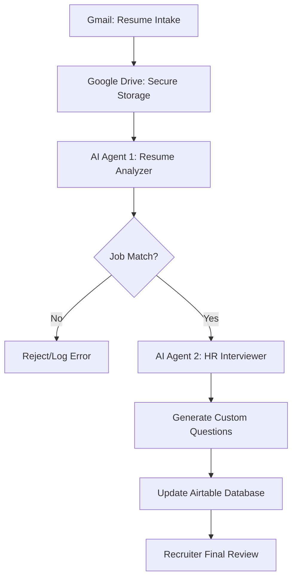

# AI-Portfolio-AndresDaza
# 🤖 AI-Powered Integrated Recruitment System

An end-to-end AI-driven recruitment automation system designed to streamline resume screening, candidate evaluation, job matching, and interview assessments using modern AI agents and workflow orchestration.

---

## 📌 Project Overview
Organizations often struggle with slow, manual, and bias-prone recruitment processes. This project addresses those challenges by introducing an AI-powered integrated recruitment system that automates:

*   **Resume Analysis:** Automatic extraction of skills and experience.
*   **Job Matching:** Intelligent alignment between candidate profiles and open vacancies.
*   **Questionnaire Generation:** AI-generated interview questions tailored to the candidate's specific background.
*   **Scoring & Shortlisting:** Objective ranking based on professional fit.

The system improves efficiency, consistency, and recruiter visibility, while ensuring that **final hiring decisions remain human-led.**

---

## 👥 Collaboration
*   **Erick Banegas**
*   **Rodrigo Sierra**
*   **Jaya Verma**

**Course:** Artificial Intelligence Resource Reference – ITAI 2376  
**Instructor:** Professor Sitaram Ayyagari  
**Date:** April 29, 2026

---

## 🔄 System Flow

1.  **Resume Intake:** Resumes arrive via email (Gmail API). Attachments are automatically stored in Google Drive.
2.  **Analysis & Job Matching (AI Agent 1):** Extracts structured data (skills, experience, education) and compares it against active job requirements in Airtable.
3.  **Questionnaire Evaluation (AI Agent 2):** Generates exactly 5 tailored interview questions based on the candidate's specific technical gaps.
4.  **Shortlisting Logic:** Candidates scoring 80% or higher are flagged as "Shortlisted."
5.  **Recruiter Oversight:** All results are stored in Airtable for final human decision-making.

---

## 🧠 AI Architecture: Two-Agent Design

The system utilizes a specialized multi-agent architecture to ensure high accuracy and cost-efficiency:

### 1. AI Agent 1 – Resume Analyzer (GPT-4o)
*   **Role:** Data Scientist & Matchmaker.
*   **Task:** Extracts structured data from unstructured resumes and matches candidates with job descriptions.
*   **Benefit:** Handles complex reasoning and multi-language support (English/Spanish).

### 2. AI Agent 2 – HR Interviewer (GPT-4o-mini)
*   **Role:** Technical Recruiter.
*   **Task:** Generates role-specific interview questions based on the analysis from Agent 1.
*   **Benefit:** Optimized for speed and specific task generation.

---

## 📊 Candidate Evaluation Logic

| Scenario | Job Match | Questionnaire Score | Outcome |
| :--- | :---: | :---: | :--- |
| **Candidate 1** | ❌ No Match | N/A | Rejected |
| **Candidate 2** | ✅ Match | < 80% | Not Shortlisted |
| **Candidate 3** | ✅ Match | ≥ 80% | ✅ **Shortlisted** |

*   ✅ Resume match alone is not sufficient.
*   ✅ Multi-stage evaluation ensures fairness.
*   ✅ No automated final hiring decisions.

---

## 🛠️ Tools & Technologies

*   **[n8n](https://n8n.io/):** Workflow orchestration and automation.
*   **[OpenAI GPT-4o](https://openai.com/):** Resume analysis, matching, and scoring.
*   **[Gmail API](https://developers.google.com/gmail/api):** Resume intake and email triggers.
*   **[Google Drive](https://www.google.com/drive/):** Secure resume storage.
*   **[Airtable](https://airtable.com/):** Candidate database, logs, and recruiter dashboard.

---

## ⚠️ Challenges & Solutions

| Challenge | Solution |
| :--- | :--- |
| **Unstructured Resume Formats** | Used Refined Prompt Engineering and enforced structured JSON outputs. |
| **Database Scalability** | Migrated to Airtable for better tracking, status visibility, and logs. |
| **Duplicate Applications** | Implemented custom lookup logic to detect duplicates by email and content hash. |
| **Ethical Considerations** | Designed the system so AI supports decisions but does not replace human judgment. |

---

## 📈 Conclusions
This AI-powered recruitment system demonstrates how modern hiring processes can be transformed through **intelligent automation while preserving human accountability**. 

The project emphasizes that real-world AI impact often comes not from complex model training, but from **connecting AI tools, workflows, and data systems** into practical, scalable solutions.

---

## 🚀 Getting Started
To import this workflow into your n8n instance:
1. Download the `Automated Resume Processing.json` file.
2. In n8n, click on **Workflows** > **Import from File**.
3. Configure your Credentials for Gmail, Google Drive, OpenAI, and Airtable.
4. Set the `Airtable Base ID` in the Search and Create nodes.
rive, OpenAI, and Airtable.
4. Set the `Airtable Base ID` in the Search and Create nodes.
